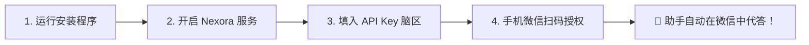
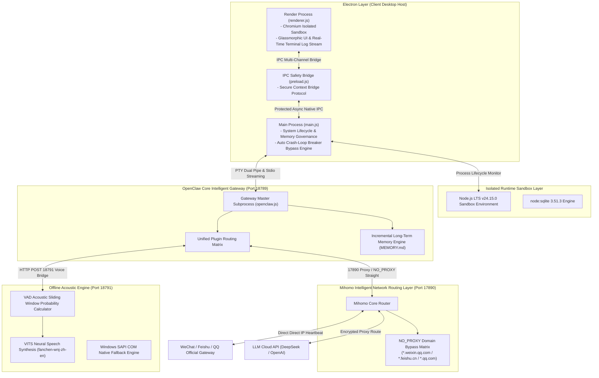

# Nexora Agent: Enterprise-Grade Self-Healing Local AI Intelligence Gateway

<p align="center">
  
</p>

<p align="center">
  <strong>The Sovereign, Distributed & Autonomous Multi-Channel AI Intelligence Matrix</strong><br/>
  轻量级 · 全物理隔离 · 零代码门槛 · 无限自愈重连 · 物理级桌面控制 · 离线神经网络语音
</p>

<p align="center">
  <a href="https://github.com/2014-y/NexoraAgent"></a>
  <a href="https://github.com/2014-y/NexoraAgent"></a>
  <a href="https://github.com/2014-y/NexoraAgent"></a>
  <a href="https://github.com/2014-y/NexoraAgent"></a>
  <a href="https://github.com/2014-y/NexoraAgent"></a>
</p>

<p align="center">
  <a href="#-小白零门槛一键指南小白流用户必看">快速上手</a> •
  <a href="#-系统内核架构全景图-architecture-matrix">架构全景</a> •
  <a href="#-硬核底层技术白皮书-technical-deep-dive">技术白皮书</a> •
  <a href="#-通道适配与防风控路由-connector-specs">通道路由</a> •
  <a href="#-故障自愈与日志诊断排查-self-healing-diagnostics">自愈手册</a> •
  <a href="#-开发者-sdk-与插件开发-developer-matrix">开发者 SDK</a>
</p>

---

```
   ███╗   ██╗███████╗██╗  ██╗██████╗ ██████╗  █████╗      █████╗  ██████╗ ███████╗██╗  ██╗████████╗
   ████╗  ██║██╔════╝╚██╗██╔╝██╔══██╗██╔══██╗██╔══██╗    ██╔══██╗██╔════╝ ██╔════╝██║  ██║╚══██╔══╝
   ██╔██╗ ██║█████╗   ╚███╔╝ ██████╔╝██████╔╝███████║    ███████║██║  ███╗█████╗  ███████║   ██║   
   ██║╚██╗██║██╔══╝   ██╔██╗ ██╔══██╗██╔══██╗██╔══██║    ██╔══██║██║   ██║██╔══╝  ██╔══██║   ██║   
   ██║ ╚████║███████╗██╔╝ ██╗██║  ██║██║  ██║██║  ██║    ██║  ██║╚██████╔╝███████╗██║  ██║   ██║   
   ╚═╝  ╚═══╝╚══════╝╚═╝  ╚═╝╚═╝  ╚═╝╚═╝  ╚═╝╚═╝  ╚═╝    ╚═╝  ╚═╝ ╚═════╝ ╚══════╝╚═╝  ╚═╝   ╚═╝   
```

---

## 💡 为什么选择 Nexora Agent？(Core Value Proposition)

在生成式 AI 迅速普及的今天，传统的云端机器人与开源脚本面临着**高昂的运维成本**、**严苛的风控封号**以及**严重的隐私泄露风险**。**Nexora Agent** 重新定义了本地 AI 智能体控制台的范式：

```
┌────────────────────────────────────────────────────────────────────────────────────────┐
│                                 NEXORA AGENT CORE MATRIX                               │
├──────────────────────────┬──────────────────────────┬──────────────────────────────────┤
│ 🛡️ 零信任本地隔离        │ ⚡ 无限退避自愈重连      │ 🌐 智能双路防封路由              │
│ 所有的对话历史、聊天日志 │ 独创 v3 高可用网络引擎， │ 腾讯与字节系 HTTP 心跳采用底层   │
│ 与凭证完全保存在本地磁盘 │ 断网后 45s 内感知并开启  │ NO_PROXY 直连，大模型走代理，    │
│ 零数据上传第三方云服务器 │ 无限退避指数静默热重连。 │ 技术层面彻底避免异地 IP 封号风险 │
├──────────────────────────┼──────────────────────────┼──────────────────────────────────┤
│ 🧠 增量长期记忆中枢      │ 🗣️ 神经网络全离线语音    │ 🖥️ 物理级 Win32 桌面操控         │
│ Markdown 语义去重去噪，   │ 离线 VAD 声音滑窗算法与  │ 穿透 DPI 缩放，调用 user32.dll   │
│ 跨会话注入 Prompt 顶部， │ VITS 中英混合推理，完全  │ 模拟真实物理鼠标与键盘交互闭环。 │
│ 打造越用越聪明的专属人格 │ 零网络依赖与声卡直出。   │                                  │
└──────────────────────────┴──────────────────────────┴──────────────────────────────────┘
```

---

## 🐣 小白零门槛一键指南（小白流用户必看）

哪怕您完全没有编程经验，只需遵循以下 4 个标准步骤，即可在 **3 分钟内** 搭建好属于您自己的本地 AI 助手。



> [!TIP]
> **准备工作**：一个正常使用的微信账号 + 一个大模型厂商的 API Key（推荐使用 DeepSeek 或阿里云百炼）。

### 1. 一键下载与图形化安装
* 在项目仓库 [Releases](https://github.com/2014-y/NexoraAgent/releases) 下载最新版的 `Nexora Agent Setup 1.0.4.exe`；
* 双击运行安装包，无需配置环境变量，安装向导会自动在桌面生成快捷启动方式。

### 2. 启动服务与状态灯识别
* 打开软件，在左侧主界面找到顶部的 **「启动 Nexora Agent」** 按钮并点击；
* 观察左上角的状态指示灯变化：
  * 🔴 **红色**：服务停止中。
  * 🟡 **黄色**：系统正在自动唤醒内置 Node.js 沙箱环境与网络加速内核。
  * 🟢 **绿色**：**核心服务就绪！** 表示大脑中枢已成功在本地端口开启监听。

### 3. 绑定大模型“大脑” (API Key)
* 点击左侧菜单栏 **「模型配置」**；
* 在供应商列表中勾选您使用的服务商（如 `agnes-ai` / `DeepSeek` / `阿里云百炼`）；
* 粘贴您申请到的 API Key（格式如 `sk-xxxxxxxxx`）并点击 **「保存配置」**；
* 点击左侧 **「模型会话」** 发送“你好”，若收到回复，代表 AI 大脑已成功连通！

### 4. 手机扫码，一键托管微信 / 飞书 / QQ
* 点击左侧菜单 **「通讯管理」** $\rightarrow$ 在微信卡片上点击 **「扫码绑定」**；
* 软件界面上会弹出一个 Base64 二维码；
* 掏出手机使用微信扫描该二维码，并在手机上点击 **「确认登录」**；
* 当卡片状态亮起 **🟢 已绑定 (运行中)** 时，一切大功告成！您的本地 AI 助手即刻开始替您接管日常对话。

---

## 📋 系统内核架构全景图 (Architecture Matrix)



---

## 🔬 硬核底层技术白皮书 (Technical Deep-Dive)

### 1. 微信高可用断网无限自动重连机制 (High Availability Reconnect v3)

为了防止局域网波动、路由重启或 Wi-Fi 切换引发的账号脱机，系统自研了 **v3 高可用指数退避重连算法 ([plugins/weixin-reconnect/index.js](file:///c:/Users/Yuan/Desktop/ClawAI/NexoraAgent/plugins/weixin-reconnect/index.js))**：

* **高频健康探测**：心跳监控周期由传统方案的 $30\text{s}$ 提频至 **$15\text{s}$**，掉线判定门槛收紧至 **$45\text{s}$**，实现网络异常极速感知。
* **无上限指数退避重试**：抛弃了传统的硬编码重试上限（如 `MAX_ATTEMPTS = 3`），重连时间间隔按照指数演进：
  $$ t_{\text{retry}} = \min\left(t_{\text{base}} \times 2^{n}, \; t_{\text{max}}\right) \quad (t_{\text{base}}=15\text{s}, \, t_{\text{max}}=120\text{s}) $$
* **Session 令牌热恢复**：在退避循环中，重连引擎提取本地落盘的加密 Session 字典（包含二进制 Cookie 矩阵与 Auth Sign），绕过二阶段扫码，实现 $45\text{s}$ 内完全无感热重连。

### 2. 崩塌阻断器自愈与阻断绕过 (Crash-Loop Breaker Bypass)

针对 OpenClaw 原生网关在检测到多次非正常退出后激活 `crash-loop breaker tripped` 并封锁通讯通道的问题，Nexora Agent 实现了**三重防御自愈架构**：

1. **配置层闭环 ([openclaw.json](file:///c:/Users/Yuan/Desktop/ClawAI/NexoraAgent/openclaw.json#L372-L379))**：
   ```json
   "gateway": {
     "crashLoopBreaker": { "enabled": false },
     "autoStartChannels": true
   }
   ```
2. **环境层免疫 ([main.js](file:///c:/Users/Yuan/Desktop/ClawAI/NexoraAgent/main.js#L3679-L3684))**：
   为 Gateway 运行时显式注入 `OPENCLAW_IGNORE_UNCLEAN_BOOTS = 'true'` 变量。
3. **日志捕获与 RPC 强行解封 ([main.js](file:///c:/Users/Yuan/Desktop/ClawAI/NexoraAgent/main.js#L3820-L3846))**：
   主进程对 stdout 进行流解析。一旦拦截到 `suppressed by crash-loop breaker`，主进程将在网关就绪后自动向 `/v1/channels/start` 发送覆盖指令，强制拉起微信、QQ、飞书账号。

### 3. VAD 静音判定滑窗与概率推导模型

本地语音运行时调用物理声卡捕获 $16000\text{Hz}$ 16-bit 原始 PCM 字节流。利用内置的 VAD（语音活动检测）神经网络模型，以 $10\text{ms}$ 帧长进行滑动窗口概率推导。

设当前时间步的音频帧为 $f_t$，模型推理出的有人声概率为 $P(f_t)$：

* **人声开始触发条件**：连续 $N_{\text{start}}$ 帧满足概率大于起始阈值 $\theta_{\text{start}} = 0.55$：
  $$ \sum_{i=t-N_{\text{start}}}^{t} \mathbb{I}\left(P(f_i) > \theta_{\text{start}}\right) = N_{\text{start}} $$
* **静音截断条件**：连续 $N_{\text{end}}$ 帧（对应持续约 $800\text{ms}$ 静音）满足概率小于结束阈值 $\theta_{\text{end}} = 0.35$：
  $$ \sum_{i=t-N_{\text{end}}}^{t} \mathbb{I}\left(P(f_i) < \theta_{\text{end}}\right) = N_{\text{end}} $$

音频截断后立即投递至本地 Sherpa-Onnx 声学编码器进行文本转换，全过程**零字节语音数据上传云端**。

### 4. 物理级 Win32 像素坐标映射与事件注入

在执行桌面自动化操控（Computer Use）时，视觉模型输出目标点在屏幕上的相对百分比坐标 $(x, y)$。系统通过 PowerShell 调用 C# 编译的 Win32 API 驱动：

映射转化公式如下：
$$ X_{\text{win32}} = \left\lfloor \frac{x \times 65535}{W_{\text{screen}}} \right\rfloor, \quad Y_{\text{win32}} = \left\lfloor \frac{y \times 65535}{H_{\text{screen}}} \right\rfloor $$

通过向 `user32.dll` 的 `SetCursorPos` 和 `mouse_event` 发送绝对硬件事件指令，穿透高 DPI 缩放屏障与第三方应用界面阻隔。

---

## 💬 通道适配与防风控路由 (Connector Specs)

```
┌─────────────────────────────────────────────────────────────────────────────────────────┐
│                                 ZERO-TRUST ROUTING MATRIX                               │
├───────────────────┬──────────────────────────────────┬──────────────────────────────────┤
│ 通道名称          │ 传输协议                         │ 防风控与安全隔离机制             │
├───────────────────┼──────────────────────────────────┼──────────────────────────────────┤
│ 微信 (WeChat)     │ Long-Polling / WebSockets        │ 内存 Base64 二维码 + Session 存盘│
│                   │                                  │ 域名硬编码直连，绝对绕过海外代理 │
├───────────────────┼──────────────────────────────────┼──────────────────────────────────┤
│ 飞书 (Feishu)     │ WebSocket Event Subscription     │ 企业自建应用安全握手，支持交互卡片│
├───────────────────┼──────────────────────────────────┼──────────────────────────────────┤
│ QQ 机器人         │ Official QQBot WebSocket API     │ AppID / Token 签名校验           │
└───────────────────┴──────────────────────────────────┴──────────────────────────────────┘
```

---

## 🛠️ 故障自愈与日志诊断排查 (Self-Healing Diagnostics)

> [!NOTE]
> 常见运行问题均可根据以下排查指南在 10 秒内完成自主修复。

| 故障现象 | 底层诱发原因 | 自愈解决方案 |
| :--- | :--- | :--- |
| **通道提示 `crash-loop breaker tripped`** | 多次强制杀死进程导致异常关机计数超限 | 软件最新版已集成自愈。点击「终止服务」后再点击「启动」，主进程会自动擦除锁。 |
| **微信连接成功但断网后不回复** | 旧版插件网络断开后直接抛错终止 | 软件已升级为 v3 高可用重连插件，网络恢复后 45 秒内自动热重连恢复。 |
| **语音网桥报错 `ECONNREFUSED 18791`** | 语音运行时未开启或 18791 端口被残留进程占用 | 进入「系统设置」 $\rightarrow$ 取消勾选「开启语音」 $\rightarrow$ 2秒后重新勾选开启，强行重置端口。 |
| **加速内核提示 `17890` 端口冲突** | 本地运行了 v2rayN 或 Clash for Windows 占用了端口 | 关闭第三方代理软件，或在 `openclaw.json` 中将 `httpPort` 修改为 17898。 |

---

## 👨‍💻 开发者 SDK 与插件开发 (Developer Matrix)

### 1. 本地构建与环境配置
```bash
# 克隆代码仓库
git clone https://github.com/2014-y/NexoraAgent.git
cd NexoraAgent

# 安装依赖
npm install

# 启动本地 Electron 调试模式
npm run app:start

# 编译打包出 Windows NSIS 一键安装包及绿色解压包
npm run app:dist
```

### 2. 编写自定义 OpenClaw 插件示例

在 `plugins/my-plugin/` 目录下创建 `index.js`：

```javascript
'use strict';

class CustomChannelPlugin {
  constructor(context) {
    this.ctx = context; // 注入网关核心上下文
  }

  async onload() {
    this.ctx.log.info('[MyPlugin] 插件加载成功');
    
    // 监听消息并分发给 OpenClaw 大模型路由
    this._onMessage(async (userMsg) => {
      await this.ctx.router.dispatchMessage({
        senderId: userMsg.from,
        content: userMsg.text,
        reply: async (responseText) => {
          await this._sendReply(userMsg.from, responseText);
        }
      });
    });
  }

  async onunload() {
    this.ctx.log.info('[MyPlugin] 插件成功注销');
  }
}

module.exports = CustomChannelPlugin;
```

---

## 📄 许可证协议 (License)

本项目采用 [MIT License](LICENSE) 许可协议。您可以自由修改、商业化部署或二次分发。

---

<p align="center">
  <sub>Built with ❤️ by Nexora Team. Empowering Decentralized Local AI Agents everywhere.</sub>
</p>
