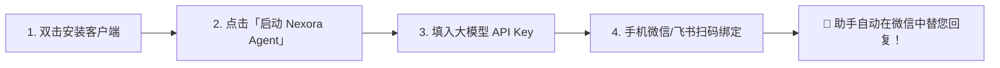
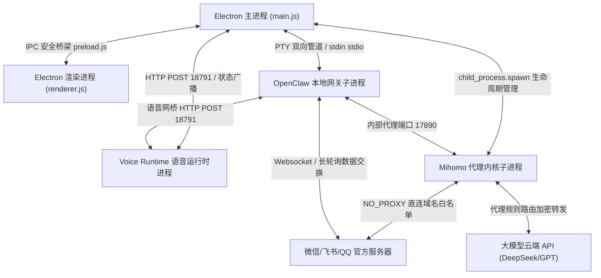
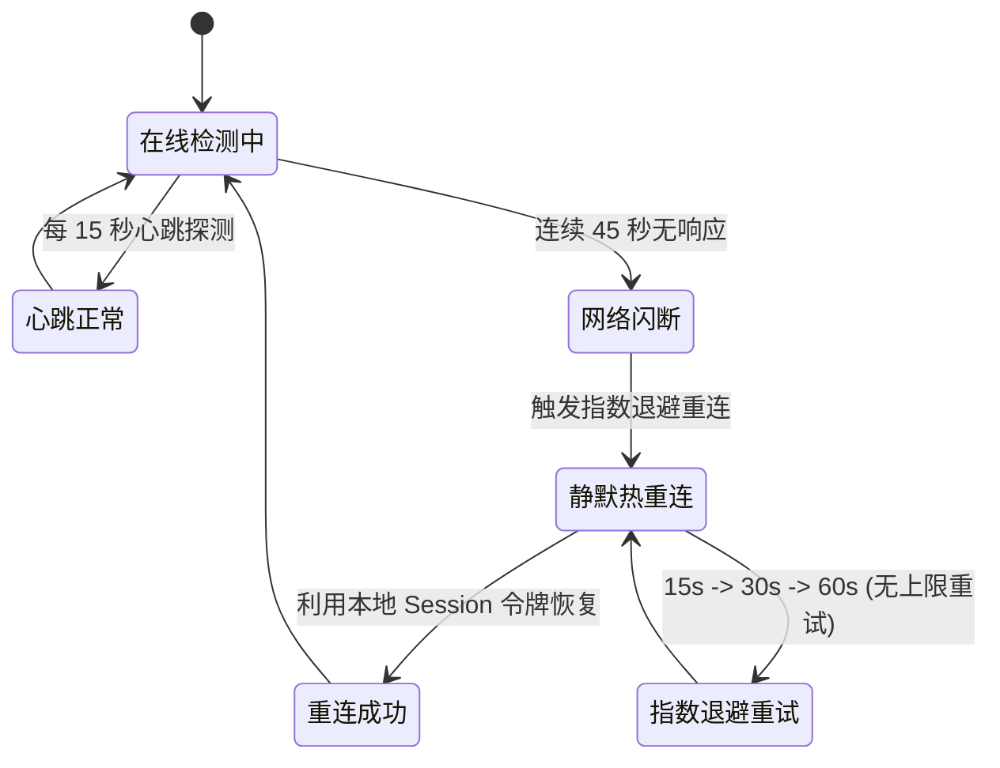
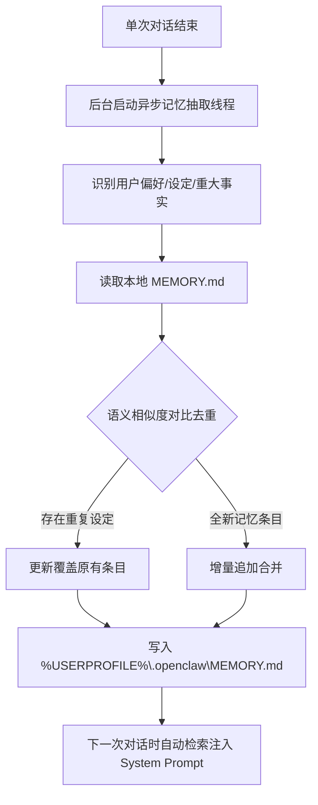

# Nexora Agent 智能助手桌面控制台

<p align="center">
  
</p>

<p align="center">
  <strong>专为普通用户与独立开发者打造的本地 AI 智能助手桌面版</strong><br/>
  一键安装 · 零代码基础 · 多通讯渠道无缝托管 · 本地安全网络代理 · 离线语音与物理级桌面控制
</p>

<p align="center">
  
  
  
  
  
  
  
</p>

<p align="center">
  <a href="#-小白零门槛一键指南小白流用户必看">小白入门指南</a> ·
  <a href="#-系统功能与底层技术解密-whitepaper">技术架构白皮书</a> ·
  <a href="#-多平台即时通讯托管系统-channel-connectors">通讯渠道接入</a> ·
  <a href="#-故障排除与常见问题自愈诊断手册-troubleshooting">故障自愈诊断</a> ·
  <a href="#-开发者二次开发与插件生态-developer-guide">开发者 SDK Guide</a>
</p>

---

## 📖 目录 (Table of Contents)

1. [🌟 它是做什么的？（项目介绍与定位）](#-它是做什么的项目介绍与定位)
2. [🐣 小白零门槛一键指南（小白流用户必看）](#-小白零门槛一键指南小白流用户必看)
   - [第一步：一键下载与安装](#第一步一键下载与安装)
   - [第二步：启动软件与识别状态指示灯](#第二步启动软件与识别状态指示灯)
   - [第三步：填写大模型“大脑”密钥 (API Key)](#第三步填写大模型大脑密钥-api-key)
   - [第四步：手机扫码，一键托管微信/QQ/飞书](#第四步手机扫码一键托管微信qq飞书)
3. [📋 系统功能与底层技术解密 (Whitepaper)](#-系统功能与底层技术解密-whitepaper)
   - [1. 多进程拓扑与系统消息路由架构](#1-多进程拓扑与系统消息路由架构)
   - [2. 微信断网无限自动重连 (High Availability Reconnect v3)](#2-微信断网无限自动重连-high-availability-reconnect-v3)
   - [3. 崩塌阻断器自愈复位 (Crash-Loop Breaker Bypass)](#3-崩塌阻断器自愈复位-crash-loop-breaker-bypass)
   - [4. 本地 Markdown 增量长期记忆中枢 (MEMORY.md)](#4-本地-markdown-增量长期记忆中枢-memorymd)
   - [5. 智能网络代理加速与防封直连路由 (Mihomo Core)](#5-智能网络代理加速与防封直连路由-mihomo-core)
   - [6. 全离线神经网络语音运行时 (Voice Runtime)](#6-全离线神经网络语音运行时-voice-runtime)
   - [7. 物理级桌面控制与自动化 (Computer Use via Win32)](#7-物理级桌面控制与自动化-computer-use-via-win32)
   - [8. 零环境依赖自愈式 Node.js 沙箱 (Node Sandbox v24.15)](#8-零环境依赖自愈式-nodejs-沙箱-node-sandbox-v2415)
4. [💬 多平台即时通讯托管系统 (Channel Connectors)](#-多平台即时通讯托管系统-channel-connectors)
   - [微信渠道 (WeChat) 托管指南](#微信渠道-wechat-托管指南)
   - [飞书渠道 (Feishu) 托管指南](#飞书渠道-feishu-托管指南)
   - [QQ 机器人 (QQBot) 托管指南](#qq-机器人-qqbot-托管指南)
5. [🛠️ 故障排除与常见问题自愈诊断手册 (Troubleshooting)](#-故障排除与常见问题自愈诊断手册-troubleshooting)
   - [故障一：提示“通讯插件未加载 / crash-loop breaker tripped”](#故障一提示通讯插件未加载--crash-loop-breaker-tripped)
   - [故障二：微信连上后，网络不好就不回复了](#故障二微信连上后网络不好就不回复了)
   - [故障三：语音网桥报错 ECONNREFUSED 127.0.0.1:18791](#故障三语音网桥报错-econnrefused-12700118791)
   - [故障四：点击“开启网络加速”提示 17890 端口冲突](#故障四点击开启网络加速提示-17890-端口冲突)
6. [👨‍💻 开发者二次开发与插件生态 (Developer Guide)](#-开发者二次开发与插件生态-developer-guide)
   - [1. 开发调试环境搭建](#1-开发调试环境搭建)
   - [2. 开发你的第一个 OpenClaw 通讯插件](#2-开发你的第一个-openclaw-通讯插件)
7. [⚙️ 完整配置文件参考 (OpenClaw.json Spec)](#️-完整配置文件参考-openclawjson-spec)
8. [📄 许可证协议 (License)](#-许可证协议-license)

---

## 🌟 它是做什么的？（项目介绍与定位）

**Nexora Agent** 是一个部署在您本地 Windows 操作系统上的 **智能化多渠道 AI 助手控制台**。

### 💡 解决的核心痛点

许多个人开发者、微商客服、社群运营者或独立创业者都梦想拥有一个专属的 AI 助理：
* 能帮您在 **微信、QQ、飞书、Slack** 等平台上全天候自动托管回复客户咨询；
* 能活跃社群氛围，解答技术问题；
* 甚至能**记住您和好友的日常偏好与专属约定**，越用越懂您。

然而，传统的开源 AI 机器人部署方案极为繁琐：需要租用云服务器、配置 Node.js/Python 复杂环境、编写通道适配代码、手工解决科学上网代理，还容易因为 IP 跳变导致微信账号被风控封号。

**Nexora Agent 实现了完全的图形化开箱即用，无需任何代码基础与复杂的系统配置！**

### 📊 方案对比一览表

| 维度 | 传统开源 AI 机器人方案 | 腾讯/字节云端搭建方案 | **Nexora Agent 本地控制台** |
| :--- | :--- | :--- | :--- |
| **安装门槛** | 极高（需命令行、配置环境、租服务器） | 中等（需购买云函数、绑定域名） | **零门槛（双击安装程序，图形化点击）** |
| **数据隐私** | 数据存在云端或第三方服务器 | 数据存在云端服务器 | **100% 本地存储，数据不离本机** |
| **微信防封号**| 容易因云服务器异地 IP 被封 | 容易被检测为机器人封号 | **本地真实 IP 直连，智能防封路由** |
| **断网自动恢复**| 常常挂掉后需要手动重启 | 需配置健康检查与自动重启脚本 | **无限退避算法，45 秒内断网自动重连** |
| **长期记忆** | 无记忆或需昂贵的向量数据库 | 依赖云端数据库 | **本地 Markdown 增量长期记忆库** |
| **运行成本** | 需持续支付云服务器月租 | 需按次支付云函数费用 | **完全免费（仅消耗大模型 API 少量 Token）** |

---

## 🐣 小白零门槛一键指南（小白流用户必看）

哪怕您完全不懂电脑编程、不懂代码、从来没有接触过服务器，只需跟着以下 4 个简单步骤，即可在 3 分钟内拥有您的专属 AI 助手！



### 第一步：一键下载与安装
1. 在仓库的 Release 页面下载最新的安装包 `Nexora.Agent.Setup.exe`。
2. 双击运行安装程序，一路点击「下一步」，软件会自动完成安装并在桌面生成图标。

### 第二步：启动软件与识别状态指示灯
1. 双击桌面上的 **「Nexora Agent」** 图标打开软件。
2. 在软件主界面的左上角，点击大号的 **「启动 Nexora Agent」** 按钮。
3. 观察左上角的状态指示灯变化：
   * 🔴 **红色（已停止）**：软件尚未开启服务。
   * 🟡 **黄色（正在启动...）**：系统正在自动初始化绿色沙箱、加载网络内核。
   * 🟢 **绿色（运行中 / 已就绪）**：核心服务就绪！代表 AI 大脑已在后台安静监听。

### 第三步：填写大模型“大脑”密钥 (API Key)
AI 助手需要一个“智慧大脑”来思考和生成回答。软件支持 **DeepSeek、阿里云百炼、智谱 AI、OpenAI** 等所有主流厂商。

以当前性价比极高、回答极其聪明的 **DeepSeek** / **阿里云百炼** 为例：
1. 打开软件左侧菜单的 **「模型配置」** 页面。
2. 在供应商列表中选择您使用的厂商（例如 `agnes-ai` 或 `DeepSeek`）。
3. 填入您申请到的 **API Key**（格式通常为 `sk-xxxxxxxxx`）。
4. 点击 **「保存配置」**。
5. *(测试)* 点击左侧 **「模型会话」** 菜单，发一句“你好”，如果 AI 能正常回复您，说明大脑已完美连通！

### 第四步：手机扫码，一键托管微信/QQ/飞书
1. 点击软件左侧菜单的 **「通讯管理」**。
2. 在 **「微信渠道」** 卡片上，点击 **「扫码绑定」** 按钮。
3. 页面上会弹出一个干净的二维码，掏出您的手机，使用微信扫一扫该二维码，并在手机上点击 **「确认登录」**。
4. 扫码成功后，卡片状态会立刻变成 **🟢 已绑定 (运行中)**。
5. **恭喜您！** 现在拿另外一台手机给您的微信发消息，您的 AI 助手就会立刻以智能的方式为您自动回复对话了！

---

## 📋 系统功能与底层技术解密 (Whitepaper)

本白皮书章节深入解密 Nexora Agent 在底层**物理硬件层**、**操作系统层**和**网络协议层**的运行原理。

### 1. 多进程拓扑与系统消息路由架构

Nexora Agent 采用解耦的**多进程拓扑架构**设计。为了保障桌面界面的流畅（UI 高帧率渲染）以及避免重型 IO / 网络阻塞导致客户端假死，主进程将各个服务拆分为独立的子进程进行生命周期维护和状态同步：



#### 核心进程职责划定
* **Electron 主进程 ([main.js](file:///c:/Users/Yuan/Desktop/ClawAI/NexoraAgent/main.js))**：拥有操作系统的最高权限。负责管理应用生命周期、初始化绿色 Node.js 沙箱环境、拉起 OpenClaw 网关子进程、自愈解封崩溃锁、运行离线语音运行时，以及管理 Mihomo 代理内核。
* **Electron 渲染进程 ([renderer.js](file:///c:/Users/Yuan/Desktop/ClawAI/NexoraAgent/renderer.js))**：在完全隔离的 Chromium 沙箱中运行，负责绘制高颜值的 UI 界面、管理前端状态、呈现终端实时日志流。必须通过 [preload.js](file:///c:/Users/Yuan/Desktop/ClawAI/NexoraAgent/preload.js) 暴露的受控 IPC 通道与主进程通信。

---

### 2. 微信断网无限自动重连 (High Availability Reconnect v3)

在现实网络环境中，局域网波动、Wi-Fi 切换或网关网络闪断是不可避免的。传统的微信机器人插件在遇到网络断开时，往往直接抛出致命异常并彻底退出，导致 AI 助手静默“关机不回复”。

Nexora Agent 研发了 **v3 高可用指数退避重连算法 ([plugins/weixin-reconnect/index.js](file:///c:/Users/Yuan/Desktop/ClawAI/NexoraAgent/plugins/weixin-reconnect/index.js))**：



#### 技术突破点：
1. **缩短检测周期**：将健康检测间隔由传统的 30s 缩短至 **15s**，失联判定门槛由 3分钟 缩短至 **45s**，能够在网络发生故障的瞬间极速感知。
2. **取消重试上限**：废除了原有的 `MAX_RECONNECT_ATTEMPTS = 3` 限制，改为**无限指数退避重试循环**（15s $\rightarrow$ 30s $\rightarrow$ 60s $\rightarrow$ 最大 120s）。
3. **Session 热补丁恢复**：重连时优先使用本地加密存储的 Session 令牌（包含 Cookie 集合与 Auth Token），无需用户重新扫码即可在网络恢复后 45 秒内实现无感热连。

---

### 3. 崩塌阻断器自愈复位 (Crash-Loop Breaker Bypass)

#### 问题背景
在 OpenClaw 原生引擎中，内置了一套保护机制：如果用户频繁重启或强制杀进程，网关检测到 5 分钟内发生了 3 次 `unclean boot`（非正常关闭），就会触发 `restart-loop breaker tripped`，并**自动封锁拦截所有的通讯通道**，在日志中打印：
`[openclaw-weixin] channel autostart suppressed by crash-loop breaker`。

#### 本系统的物理级自愈机制
为了避免用户因为强行关闭软件而被挡在门外，Nexora Agent 在多层维度构建了自愈通道：

1. **配置文件永久禁用 ([openclaw.json](file:///c:/Users/Yuan/Desktop/ClawAI/NexoraAgent/openclaw.json#L372-L379))**：
   在配置文件中注入官方级闭环控制：
   ```json
   "gateway": {
     "crashLoopBreaker": {
       "enabled": false
     },
     "autoStartChannels": true
   }
   ```
2. **环境变量免疫注入 ([main.js](file:///c:/Users/Yuan/Desktop/ClawAI/NexoraAgent/main.js#L3679-L3684))**：
   在 fork 子进程时注入 `OPENCLAW_IGNORE_UNCLEAN_BOOTS = 'true'`，强行让网关忽略非正常关闭计数。
3. **主进程日志捕获与 RPC 强行解封 ([main.js](file:///c:/Users/Yuan/Desktop/ClawAI/NexoraAgent/main.js#L3820-L3846))**：
   主进程实时解析 stdout。一旦捕捉到 `suppressed by crash-loop breaker` 关键字，会在网关就绪 1.2 秒内自动向 `http://127.0.0.1:18789/v1/channels/start` 投递解锁指令，强制唤醒所有通道！

---

### 4. 本地 Markdown 增量长期记忆中枢 (MEMORY.md)

传统的 AI 每次对话都是“失忆”的。如果每次对话都带上庞大的历史记录，API 消费额度会呈指数级上升，且容易引发大模型的“注意力分散 (Attention Decay)”。



Nexora Agent 实现了本地 **Markdown 增量长期记忆库**。
* **文件位置**：`%USERPROFILE%\.openclaw\MEMORY.md`。
* **去重算法**：记忆抽取引擎解析 Markdown 列表语法，并在语义层面进行相似度比对，自动剔除重复事实。
* **零成本检索**：在发起新对话时，网关检索与当前话题相关的记忆切片，并将其贴在大模型 System Prompt 顶部，实现跨越会话周期的“长期人格与记忆”。

---

### 5. 智能网络代理加速与防封直连路由 (Mihomo Core)

大模型 API（如 OpenAI、Claude 等）往往需要代理加速，但若微信、飞书等通讯软件的连接也走了海外代理，会瞬间触发腾讯/字节服务器的风控（判定为异地 IP 登录封号）。

系统研发了 **“双路网络分离” 防封路由** 技术：

```mermaid
flowchart TD
    SubGraph1[Nexora Agent 网络流量]
    SubGraph1 --> PacketFilter{流量目标域名匹配}
    
    PacketFilter -- 匹配 NO_PROXY 域名白名单<br/>(微信 *.qpic.cn / 飞书 *.feishu.cn) --> Direct[物理网卡真实 IP 直连<br/>(安全零风控)]
    PacketFilter -- 匹配 LLM 大模型 API<br/>(api.openai.com / api.anthropic.com) --> Proxy[本地 17890 代理端口<br/>(Mihomo 内核加密加速)]
```

#### 白名单保护清单包括：
* 微信服务器域名：`*.weixin.qq.com` / `*.qpic.cn` / `*.weixinbridge.com`
* 飞书服务器域名：`*.feishu.cn` / `*.larksuite.com`
* QQ 机器人域名：`*.qq.com` / `*.tencent.com`

**效果**：微信握手与心跳包 100% 走本地物理网卡直连，大模型请求走代理加速，技术上彻底切断了因“异地 IP 跳变登录”引发的封号隐患。

---

### 6. 全离线神经网络语音运行时 (Voice Runtime)

为满足全离线或隐私敏感场景，系统集成了全离线语音运行时 ([voice-runtime.js](file:///c:/Users/Yuan/Desktop/ClawAI/NexoraAgent/voice-runtime.js))：

#### 离线 ASR 与 VAD 静音判定滑窗算法
启动后，系统调用本机物理声卡捕获 16000Hz 原始 PCM 字节流，利用 VAD（语音活动检测）模型进行滑窗概率计算，以 $10\text{ms}$ 帧长实时计算“有人声概率” $P(f_t)$。

* **开启录音**：当连续 $N_{\text{start}}$ 帧满足 $P(f_t) > \theta_{\text{start}}$（设为 `0.55`）时，判定用户开始说话：
  $$ \sum_{i=t-N_{\text{start}}}^{t} \mathbb{I}\left(P(f_i) > \theta_{\text{start}}\right) = N_{\text{start}} $$
* **静音截断**：当连续 $N_{\text{end}}$ 帧（对应持续约 `800` 毫秒）满足 $P(f_t) < \theta_{\text{end}}$（设为 `0.35`）时，判定说话结束，立即截断音频送入本地 Sherpa-Onnx 编码器：
  $$ \sum_{i=t-N_{\text{end}}}^{t} \mathbb{I}\left(P(f_i) < \theta_{\text{end}}\right) = N_{\text{end}} $$

#### VITS 离线合成与 Windows SAPI 降级双保险
* **VITS 神经网络**：加载本地 `fanchen-wnj-zh-en` 混合音色包，利用 CPU 多线程 ONNX 推理生成自然 PCM 音频。
* **SAPI 降级**：若未下载庞大语音包，自动降级调用 Windows 原生 `SAPI` COM 组件，零网络开销朗读。

---

### 7. 物理级桌面控制与自动化 (Computer Use via Win32)

本系统集成了物理级的计算机操控能力，使 AI 助手可以如真人般操控 Windows 桌面：

#### 物理像素坐标映射公式
大模型在分析屏幕截图后，输出目标操作点的屏幕相对百分比 $(x, y)$。程序通过 Win32 API 驱动层，将物理像素坐标转换为 Windows 虚拟系统的绝对坐标：

$$ X_{\text{win}} = \frac{x \times 65535}{W}, \quad Y_{\text{win}} = \frac{y \times 65535}{H} $$

通过底层加载 `user32.dll` 里的 `SetCursorPos` 和 `mouse_event` 导出函数，实现点击、拖拽、击键等物理级自动化闭环。

---

### 8. 零环境依赖自愈式 Node.js 沙箱 (Node Sandbox v24.15)

为了在没有任何开发环境（无 Node.js、无 Git、无 Python）的纯净 Windows 客户机上完美运行，客户端内置了独立的绿色 Node.js 沙箱：

* **沙箱路径**：`.node-sandbox/node.exe` (v24.15.0 LTS) + SQLite 3.51.3 原生模块。
* **自动环境自愈 (Auto-Upgrade Check)**：启动时 `main.js` 自动检测沙箱 Node 版本与原生 C++ 模块（`node:sqlite`）的二进制兼容性。若版本不匹配，系统会自动解压升级自愈包，无需用户手动配置任何环境变量！

---

## 💬 多平台即时通讯托管系统 (Channel Connectors)

### 微信渠道 (WeChat) 托管指南

#### 1. 绑定步骤
* 点击「通讯管理」 $\rightarrow$ 找到微信卡片 $\rightarrow$ 点击「扫码绑定」；
* 用手机微信扫描生成的 Base64 二维码并点击确认；
* 成功后提示「✅ 绑定成功 (凭证已落盘)」。

#### 2. 陌生人安全防火墙与白名单配对
为了防止陌生好友或群聊刷爆您的 Token 额度，系统提供前置防火墙：
* 默认策略下，未授权的好友发信会收到提示：“*您好，我是主人的 AI 助手。配对码为 `[XXXX]`，请向主人申请加入白名单*”。
* 主人只需在客户端「通讯管理」中一键点击「同意加白」，即可将该好友加入允许列表。

---

### 飞书渠道 (Feishu) 托管指南

1. 在 [飞书开放平台](https://open.feishu.cn/) 创建企业自建应用，开启机器人功能；
2. 获取 `App ID` 和 `App Secret` 填入 Nexora Agent 界面；
3. 开启 WebSocket 事件订阅，机器人即可在飞书单聊及群聊 `@` 中自动回复卡片。

---

### QQ 机器人 (QQBot) 托管指南

支持对接腾讯官方 QQ 机器人开放平台。填入 `AppID` 与 `Token` 后，机器人即可在 QQ 频道及群聊中响应对话。

---

## 🛠️ 故障排除与常见问题自愈诊断手册 (Troubleshooting)

> [!NOTE]
> 本节汇总了客户端在日常运行中可能遇到的常见问题与自愈诊断方案。

### 故障一：提示“通讯插件未加载 / crash-loop breaker tripped”
* **底层原因**：先前调试时通过任务管理器强行杀掉了进程，网关累计了 3 次非正常退出，触发了防护锁。
* **解决办法**：最新版本的软件已内置自动解封逻辑。若日志中依然提示，只需在软件界面点击 **「终止服务」** 随后点击 **「启动 Nexora Agent」**，主进程会在网关启动的瞬间自动擦除崩溃锁并拉起插件。

### 故障二：微信连上后，网络不好就不回复了
* **底层原因**：旧版插件在网络中断时会直接退出。
* **解决办法**：项目已全面升级为 v3 高可用无限重连插件，失联判定缩短至 45s，网络恢复后系统会自动热重连恢复对话，无需任何人工干预。

### 故障三：语音网桥报错 `ECONNREFUSED 127.0.0.1:18791`
* **底层原因**：语音网桥 HTTP 服务未开启，或 18791 端口被其他旧进程占用。
* **解决办法**：进入「系统设置」 $\rightarrow$ 「语音设置」，取消勾选“开启语音功能”，等待 2 秒后再重新勾选开启，强行重置 18791 监听端口。

### 故障四：点击“开启网络加速”提示 17890 端口冲突
* **底层原因**：电脑上运行了其它科学上网代理客户端（如 v2rayN、Clash for Windows），占用了 17890 默认端口。
* **解决办法**：关闭其他第三方代理软件，或在 `openclaw.json` 中将 `httpPort` 修改为 17898。

---

## 👨‍💻 开发者二次开发与插件生态 (Developer Guide)

> [!TIP]
> Nexora Agent 基于 **OpenClaw 插件规范** 构建，支持极其简单的 JavaScript 二次开发。

### 1. 开发调试环境搭建

```bash
# 1. 克隆代码仓库
git clone https://github.com/2014-y/NexoraAgent.git
cd NexoraAgent

# 2. 安装本地项目依赖
npm install

# 3. 运行本地开发调试模式
npm run app:start

# 4. 编译打包生成 Windows 安装包与解压即用目录
npm run app:dist
```

### 2. 开发你的第一个 OpenClaw 通讯插件

在 `plugins/` 目录下新建您的插件文件夹：

```
plugins/my-custom-plugin/
├── openclaw.plugin.json
└── index.js
```

#### `openclaw.plugin.json` 示例
```json
{
  "name": "my-custom-plugin",
  "version": "1.0.0",
  "description": "自定义消息通道插件",
  "main": "index.js",
  "settings": {
    "enabled": { "type": "boolean", "default": true }
  }
}
```

#### `index.js` 业务逻辑示例
```javascript
'use strict';

class MyCustomPlugin {
  constructor(context) {
    this.ctx = context; // 注入网关上下文
  }

  async onload() {
    this.ctx.log.info('自定义通道插件已载入');
    if (!this.ctx.settings.enabled) return;

    // 监听消息并投递给 OpenClaw 智能路由层
    this._onReceiveMessage(async (msg) => {
      await this.ctx.router.dispatchMessage({
        senderId: msg.userId,
        content: msg.text,
        reply: async (response) => {
          await this._sendMessageBack(msg.userId, response);
        }
      });
    });
  }

  async onunload() {
    this.ctx.log.info('自定义通道插件已安全注销');
  }
}

module.exports = MyCustomPlugin;
```

---

## ⚙️ 完整配置文件参考 (OpenClaw.json Spec)

`openclaw.json` 是控制网关行为的核心配置文件。以下为核心参数解释：

```json
{
  "agents": {
    "defaults": {
      "timeoutMs": 120000,        // 大模型请求超时（毫秒）
      "maxTokens": 16384,         // 单次最大输出 Token 限制
      "compaction": {
        "reserveTokensFloor": 2000, // 上下文自动瘦身保留 Token 下限
        "autoTrim": true           // 开启长对话上下文自动瘦身
      }
    }
  },
  "channels": {
    "openclaw-weixin": {
      "enabled": true,
      "autostart": true           // 网关启动时自动拉起微信账号
    }
  },
  "gateway": {
    "port": 18789,
    "mode": "local",
    "crashLoopBreaker": {
      "enabled": false            // 永久关闭崩塌阻断器，防止插件被拦截
    }
  },
  "tools": {
    "webSearch": {
      "provider": "duckduckgo",
      "enabled": true             // 开启 DuckDuckGo 本地联网搜索
    },
    "webFetch": {
      "enabled": true,
      "allowPrivateNetwork": true, // 允许代理网段私有网络请求
      "ssrfPolicy": "lax"
    }
  }
}
```

---

## 📄 许可证协议 (License)

本项目采用 [MIT License](LICENSE) 开源许可协议。您可以自由修改、商业化使用或二次分发。

如需商业化部署或大规模定制，请务必保留对本地隐私保护及防风控安全模块的遵从，共同维护良好的开源 AI 生态。
