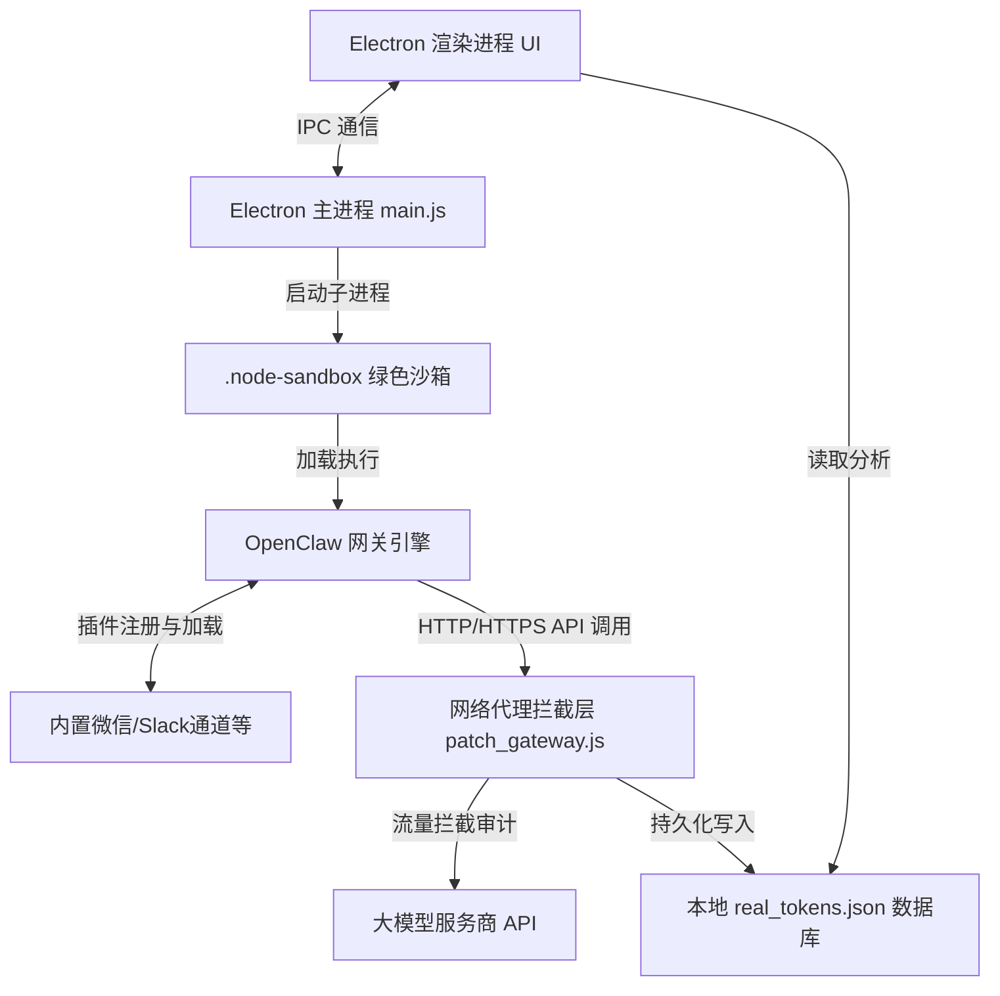

# ClawAI 开源版

<p align="center">
  
</p>

<p align="center">
  <strong>基于 Electron + OpenClaw 深度定制的本地零依赖 AI 智能网关控制台</strong>
</p>

<p align="center">
  <a href="https://nodejs.org"></a>
  <a href="https://github.com/electron/electron"></a>
  <a href="LICENSE"></a>
</p>

---

## 📖 项目简介

ClawAI 是一款专为降低 AI 智能网关（Agent Gateway）部署门槛而设计的桌面控制台客户端。项目基于 **Electron** 桌面框架与 **OpenClaw** 开源 AI 网关底层进行深度重构，通过内置高度优化的绿色运行沙箱及关键插件，实现无需任何全局环境配置、开箱即用的 AI 网关与多渠道聊天（微信、Slack、Matrix 等）接入能力。

---

## 🛠️ 技术架构与系统组成

ClawAI 整体架构采用**主从双进程架构**与**绿色沙箱隔离设计**，核心技术栈及作用如下：



### 1. 桌面客户端外壳 (Electron Shell)
* **主进程 (main.js)**：负责管理窗口生命周期、处理 IPC 通信、监控后台网关子进程运行状态，并提供健壮的安全防护（如防退出冲突、环境自愈）。
* **渲染进程 (renderer.js)**：使用 Vanilla JS 构建，渲染流畅无延迟。内置丰富的交互动效，负责大模型配置管理、卡片动态折叠展开、流量消耗的可视化图表渲染。

### 2. 隔离运行沙箱 (.node-sandbox)
* 预先打包精简版 Node.js 与 npm 绿色环境，用户首次运行或开发初始化时，会自动建立专用的依赖与执行路径。这使得 ClawAI 彻底脱离了对用户系统环境变量（如全局 PATH）的依赖，避免了环境污染，支持多电脑快速无感迁移。

### 3. 网关引擎核心 (OpenClaw Daemon)
* 作为本地后台服务运行。负责维护模型分发服务、会话上下文管理、系统钩子（Hooks）处理以及各种生态插件（Plugins）的动态热加载。

### 4. 流量审计劫持器 (patch_gateway.js)
* 采用无侵入式的方法拦截 Node.js 的 `http` 和 `https` 模块底层的 `request` 方法。当网关引擎向大模型厂商接口发送请求时，拦截器会自动解析输入（Prompt）与输出（Completion）的数据流，精确统计 Token 消耗并估算使用成本，写入本地数据库。

---

## 🌟 核心功能与技术实现细节

### 1. 🔌 零依赖一键运行与环境自愈
* **免装运行环境**：程序启动时会检测 `.node-sandbox` 并自动配置临时环境变量。无需用户预先安装 Node.js、Git、Python 或各种编译工具链。
* **微信插件预装与自适应激活**：在 Electron 主进程读取配置时，会自动对微信插件（`@tencent-weixin/openclaw-weixin`）的本地路径进行动态绝对路径转换，并注入到 OpenClaw 信任列表（`plugins.allow`）。这**彻底解决了在免安装或新电脑运行下，因缺少路径信任导致后台卡死在终端询问（* Install Weixin plugin?）的重大故障，实现秒级生成登录二维码。**

### 🔑 2. 安全级密钥物理隔离与防泄漏锁
为了防范内置密钥泄露，ClawAI 在前端和配置层面实现了多层防盗拷保护：
* **明文禁止查看**：前端界面物理移除了明文查看按钮。
* **输入框只读与防护锁**：内置大模型通道的密钥配置框被强制设为 `readonly`。
* **输入事件强力拦截**：底层重写并拦截了该输入框的键盘复制剪切事件 (`copy`, `cut`)、鼠标拖拽事件 (`dragstart`, `drop`)、以及鼠标右键菜单事件，物理切断了通过界面导出、复制内置密钥的任何可能性。

### 📉 3. 实时 Token Telemetry（流量卫士）
* **底层数据流拦截**：在 `patch_gateway.js` 中，通过改写 Node.js 内置的网络请求，捕获 `openai` 兼容协议包的返回体，分析其 `usage.prompt_tokens` 与 `usage.completion_tokens`。
* **离线本地数据库**：数据以 JSON 结构持久化保存在用户本地目录下的 `real_tokens.json`，确保用量数据的隐私安全。
* **可视化数据折线看板**：在前端“用量监控”中，利用图表库动态绘制折线图，直观展现每日 Token 消耗曲线、API 响应耗时、请求次数以及网关缓存命中率。

### 🎨 4. 页面空间优化与物理防呆锁
* **智能排序与展收**：将主推或内置的大模型卡片置顶渲染，所有卡片默认折叠，通过平滑的折叠动画提供清爽的界面交互。
* **防误删锁**：对关键的核心配置（如默认模型、Ollama 本地模型）卡片进行物理锁定，移除了配置界面上的删除按钮，避免用户误操作导致核心通路断开。

---

## 🔄 运行与运作流程

ClawAI 运行时的数据与控制流向如下：

### 1. 启动与初始化阶段
1. 用户启动 ClawAI 应用。
2. Electron 主进程在后台检测并设置 `.node-sandbox` 绿色运行环境。
3. 主进程读取本地网关配置文件 `.openclaw/openclaw.json`，自动检测微信等关键插件的本地绝对路径并写入路径信任名单。
4. 主进程通过 Node.js 子进程拉起 OpenClaw 网关引擎，并将其 `stdout`/`stderr` 标准输入输出流与主进程绑定。

### 2. 微信/聊天通道绑定阶段
1. 用户在控制台点击「绑定微信」或启用相关插件。
2. 网关引擎启动微信登录子进程（Wechaty 服务）。
3. 微信子进程接收到微信扫码登录 URL，通过标准输出打印。
4. 主进程拦截输出流，过滤 ANSI 颜色逃逸字符，精确提取 URL 并发送给渲染进程。
5. 渲染进程渲染为二维码，用户扫码后微信子进程成功登录。

### 3. 对话与流式转发阶段
1. 用户在微信中向 AI 助手发送消息。
2. 微信通道插件接收消息并封装成 OpenClaw 统一标准格式。
3. 网关引擎处理消息，匹配相应大模型模板，并向大模型服务商发起 API 请求。
4. 网络拦截层 `patch_gateway.js` 拦截该请求，监控其数据交互。
5. 大模型返回回复，网关引擎通过微信通道回复给微信用户。
6. 拦截层记录此次对话所产生的 Token 消耗，写入本地 `real_tokens.json`，前端用量监控同步更新。

---

> [!TIP]
> **💡 魔法网络加速**：如在下载依赖、拉取模型或访问大模型 API 时遇到网络困难，可使用推荐的 [网络加速通道](https://pin.dianping.men/auth/register?code=2k788U5v)（注册即可获取极速网络环境支持）。

---

## 🛠️ 开发者指南（源码构建）

### 1. 准备工作
克隆代码库并进入项目根目录：
```bash
git clone https://github.com/2014-y/ClawAI.git
cd ClawAI
```

### 2. 初始化沙箱开发环境
在项目根目录下双击运行 `init.bat` 脚本（或在 PowerShell 中执行 `.\init.ps1`）。它会自动拉起独立 Node 绿色沙箱，复制必要模块并生成基本配置文件。

### 3. 运行与调试
* **启动桌面控制台调试**：
  ```bash
  npm run app:start
  ```
* **手动单独启动网关服务**：
  运行根目录下的 `start-gateway.bat`。

### 4. 编译与打包分发
打包为单文件 Windows 安装包（打包结果输出在 `dist` 目录中）：
```bash
npm run app:dist
```

---

## 📑 项目核心文件说明

* `main.js`：Electron 主进程。负责网关与微信子进程生命周期管理、系统 IPC 数据中转。
* `renderer.js`：Electron 渲染进程。实现大模型通道折叠/展收逻辑、内置通道密钥防复制安全防护、用量看板等前端 UI。
* `patch_gateway.js`：网关 API 拦截插件。通过重写基础网络请求库统计 Token 使用，实现本地离线记账。
* `init.ps1` / `init.bat`：绿色沙箱自动初始化与本地模块热同步。
* `start-gateway.bat` / `start-gateway.ps1`：沙箱环境下独立拉起本地网关守护进程的工具脚本。

---

## 📜 开源协议

本项目遵循 [MIT License](LICENSE) 许可协议。
